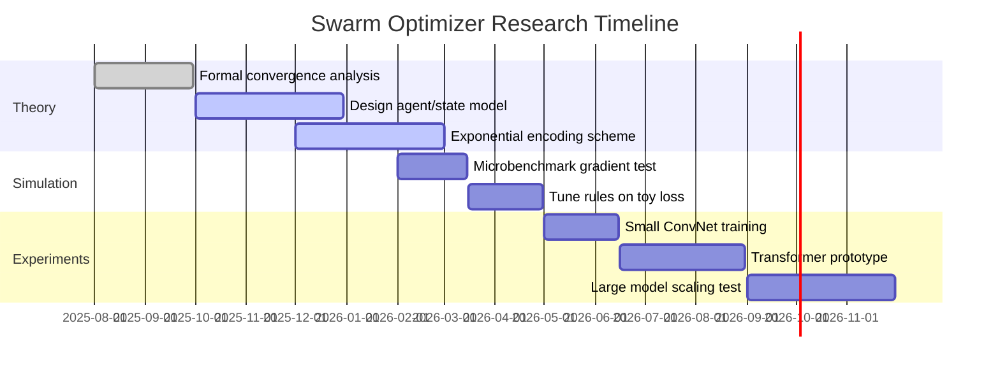

# Swarm Binary/Ternary Optimizers for Massive Models

**Executive Summary:** Current 1-bit/ternary LLMs like BitNet achieve low-bit inference, but training still uses full-precision weights, gradients, and optimizers. In practice, a trillion-parameter model with FP16 weights and Adam optimizer requires on the order of **10–20 TB** of memory for weights+optimizer. Simply switching to ternary weights (1.58 bits) does **not** reduce training memory, since latent real-valued weights and moments still dominate. To break this bottleneck, we propose a *Swarm Binary/Ternary Optimizer*: each parameter is updated by a population (swarm) of discrete agents rather than a floating-point value. The swarm collectively encodes both the **direction** and **magnitude** of the update. For example, 64 binary “votes” could approximate a small positive gradient,  and 8,192 votes could encode a much larger one (an exponential effect).  This idea (combining swarm intelligence with low-bit updates) appears novel; existing work on BNNs either retains real-valued optimizer state (BitNet, BOP, Diode) or uses gradient-free continuous swarms (AdaSwarm), but not both discrete and collective. The key contributions of this report are:

- **Training Memory Analysis:** We quantify memory for FP16/Adam training (∼16 bytes/param) and compare to swarm-based updates (∼N bits/param for N agents). For plausible swarm sizes (e.g. 32–64 agents), optimizer memory could drop by up to 8–16×, enabling 10–20× larger models with the same hardware. We provide a table contrasting 1T FP16 vs. 1.58T ternary/swarm regimes.
- **Swarm Design:** We outline how each agent’s **state** might consist of a **direction** (±1 or 0), a small **confidence counter** (few bits), and optional **age**. Agents observe only the **sign** of the true gradient (or a ternary quantized gradient) and update their state via bitwise rules. The parameter update is then the *aggregate vote* of all agents. Importantly, by assigning agents to hierarchical groups, the swarm can emulate a floating-point–style “exponent and mantissa” encoding of updates, allowing very small and very large effective step sizes. 
- **Convergence Theory:** We discuss that as swarm size \(N\to\infty\), the average vote converges (by the law of large numbers) to the true gradient direction, recovering SGD in expectation. We also note the need for variance control and potentially adaptive step-size rules to ensure stability, similar to stochastic quantization methods. Fully quantized optimizers (e.g. *stochastic ternary momentum*) have been shown to converge under standard conditions, and we expect the swarm method can be analyzed similarly.
- **Engineering Tradeoffs:** We compare bytes/param and compute for different designs. For instance, a 1T-parameter model with FP16/Adam needs ~12 bytes for moments plus 2 bytes for weight (∼14B), whereas a ternary 1.58T model with 32 agents/param (1 bit each) would need ∼4 bytes total (1.58T×2 bits for weights + 32 bits for agents ≈ 33 bits ≈ 4B). This ~4×–8× reduction in optimizer memory could translate to ~40–60% lower total GPU memory (activations still dominate). We include a comparison table for sample model sizes. Computationally, bitwise operations (XNOR, OR, POPCOUNT) can update all agents in parallel per parameter, which is very hardware-friendly. 
- **Related Work:** We survey quantized-training methods (8-bit Adam, 2-bit “SOLO” Adam, sign-based BNN optimizers like Diode, BOP, SGD-AT, noise_step, AdaSwarm, etc.). None combine discrete agents with collective voting, although Diode and BOP show that latent-free sign updates can work well.
- **Experiments and Protocols:** We propose three experiments: (1) *Toy BNN/CNN*: e.g. binary ResNet on CIFAR, to test convergence and tune swarm hyperparameters; (2) *Medium Transformer*: e.g. small GPT on text, to measure impact on NLP loss and stability; (3) *Large Sparse Model*: e.g. mixture-of-experts or chunk training to stress memory. For each we specify metrics (accuracy/perplexity, memory usage, step dynamics), baselines (Adam, BOP, Diode), and ablations (vary swarm size, threshold, hybrid schemes). We illustrate agent-state flows and outline a step-by-step update in a diagram below.
- **Hardware Mapping:** We note that agent bits can be **bit-packed** (e.g. 64 agents in a 64-bit word) and updated with bitwise ops and population counts, similar to binary neural network acceleration. GPU/TPU instructions (XNOR+POPCOUNT) make thousands of bit operations as cheap as a few float ops. In custom accelerators, one could even build each parameter’s agents into a tiny finite-state machine. We include a schematic flowchart for agent updates. 
- **Risks & Mitigations:** A key challenge is *vanishing small updates*: if an update has magnitude less than one vote, no weight flips occur. We discuss solutions like increasing swarm size, using multi-level confidence (agents with multi-bit counters), or hybrid schemes that occasionally apply a tiny FP “kick.” Another risk is that LLM training is still dominated by activations/KV caches, so even an order-of-magnitude optimizer win doesn’t fully free memory; we recommend combining with activation checkpointing and low-precision activations. Stability (oscillations, noise) is also a concern, motivating adaptive swarms or exponential step encoding. We compare these to known issues in quantized Adam.
- **Next Steps:** We recommend first establishing a mathematical analysis: e.g. show that with \(N\) agents, the expected update equals a clipped SGD step, and analyze variance. In parallel, implement a simulation of a swarm-optimizer on small models to validate gradient approximation (e.g. test how many agents needed to approximate a given FP gradient to X\% accuracy). The proposed timeline below lays out theory, simulation, and successive experiments. If results are promising, prototyping on GPUs (using bitwise ops) or even an FPGA could follow.

## Background: Low-Bit Models and Training Challenges  
Recent work (BitNet and variants) has shown that LLM weights and activations can be quantized to ternary or binary without catastrophic loss. However, **training** these models still **uses full-precision arithmetic**. BitNet, BitNet-b1.58, FBI-LLM, etc. all maintain latent FP weights, gradients, and use Adam/SGD as usual. For example, the BitNet survey notes that *“BitNet uses low-precision weights and activations, while gradients and optimizers are still stored in high precision”*.  A trillion-parameter FP16 model thus needs ~1.6 bytes/param for weights + another 14 bytes for Adam’s two moments (plus a master copy). In short, standard training memory ≈ 16 bytes/param. In contrast, the *inference* memory for 1.58-bit weights is tiny, so the bottleneck is clearly the optimizer state.  

Binary/ternary networks have distinct optimization dynamics. Helwegen et al. (BOP) argue that latent FP weights merely provide “inertia” and are not actual weights. BOP replaces latent weights with a single moving-average momentum and flips bits when it exceeds a threshold. Diode pushes this further: it uses only the **sign** of past gradients and drops any latent FP state entirely, updating binary weights based on a low-bit sign‐momentum. These show that **latent-free, sign-based optimizers can work well** for vision and NLP BNNs. However, even BOP and Diode keep **some** FP states (momentum in BOP, a tiny sign-momentum accumulator in Diode), so they only cut memory by ∼2× (one 32-bit per weight instead of three).  

Another line uses **very low-bit quantized Adam**: e.g. 8-bit or 4-bit quantization of Adam moments. The SOLO paper shows it is *theoretically* possible to use 2–3 bit states with careful log-scaling. More radically, Bar et al. (TMLR 2026) propose *“stochastic ternary momentum,”* a fully quantized optimizer where parameters, gradients, and momentum are all ternary symbols. They prove convergence for convex and non-convex cases. So quantized optimizers exist, but they still treat *each parameter* as one variable, just quantized. **No prior work** uses a *population of bits/agents per parameter* to compute updates, which is our key novelty. 

Swarm or population techniques (e.g. AdaSwarm) can approximate gradients with many “particles,” but AdaSwarm’s particles are continuous vectors (it’s essentially PSO with momentum). Our idea is to use **binary/ternary agents as the particles**, whose discrete states collectively approximate a continuous update. This bridges swarm optimization and BNN training in a new way.

## Swarm Optimizer Concept  

- **Agent State:** Each parameter \(w_i\) has an associated *swarm* of \(N\) agents. An agent’s state could be structured as \((d,c,a)\): a **direction** \(d\in\{-1,0,+1\}\), a small **confidence/counter** \(c\in\{0,1,\dots,C_{\max}\}\) (e.g. 3–5 bits) and possibly an **age** or decay factor \(a\). Intuitively, \(d=+1\) means this agent “votes” to increase \(w_i\), \(d=-1\) means “vote to decrease,” and \(d=0\) means neutral. The confidence \(c\) accumulates evidence over time (like the magnitude of a latent weight).  

- **Gradient Observation and Agent Update:** On each minibatch, compute the usual *pseudo-gradient sign* \(\text{sign}(\partial \mathcal{L}/\partial w_i)\) (or a ternary quantization of the gradient) for parameter \(w_i\).  Each agent independently updates its \((d,c,a)\) using simple rules, for example: if the observed gradient sign is positive, some agents increment their confidence if \(d=+1\) or switch direction if \(d=-1\), possibly after confidence underflows. If the sign is negative, vice versa. Agents with \(d=0\) may pick a direction when their confidence threshold is exceeded in either sign. These updates require only **bitwise operations** (increments, decrements, comparisons) on the discrete fields.  

- **Aggregation (Voting) and Parameter Update:** After the agents update, we compute the net vote: e.g. sum of \(d\) values (or simply count of \(d=+1\) minus count of \(d=-1\)). If the majority of agents vote +1 (or the signed sum exceeds a threshold), we flip \(w_i\) toward +1; if the majority is -1, flip toward -1; otherwise leave it unchanged.  In effect, the swarm’s vote replaces the SGD update \(w_i \leftarrow w_i - \eta g_i\).  

- **Exponential Encoding:** To handle very large or very small effective updates, we can arrange agents hierarchically. For instance, divide the \(N\) agents into groups that produce exponential “place values.”  One can imagine 6 bits of “exponent” encoded by how many agents are *active* at all, and 6 bits of “mantissa” from how many in each active group vote + vs –. Concretely, an agent might have another flag “active/inactive” so that only a subset of agents participate each step.  By controlling how agent counts double or halve, the swarm can represent a wide dynamic range: a single active agent out of 64 might represent a tiny \(2^{-6}\) step, whereas all 64 flipping would represent a large unit step. This is analogous to a floating-point representation but in purely discrete form.  

- **Algorithm Sketch:** In pseudo-code, one update step might look like:

   ``` 
   for each parameter i:
       g_i = sign( dL/dw_i )  (compute scalar sign)
       for each agent j in 1..N:
           if Agent[j].d == +1:
               Agent[j].c += (g_i==+1) ? 1 : -1
           elif Agent[j].d == -1:
               Agent[j].c += (g_i==-1) ? 1 : -1
           if Agent[j].c < 0:
               Agent[j].c = 0; 
               Agent[j].d = (g_i==+1 ? +1 : (g_i==-1 ? -1 : 0))
           if Agent[j].c > C_max:
               Agent[j].c = C_max
       // optional: agent aging or resetting logic
       vote = sum_j Agent[j].d
       if vote > T: w_i = +1
       elif vote < -T: w_i = -1
       // else leave w_i (or incrementally adjust confidence of w_i)
   ```
   (Here \(C_{\max}\) and \(T\) are small integer thresholds.) Notice only **increments, decrements, sign-tests and flips** are used; no FP arithmetic at all.  This is reminiscent of *sign descent* ideas, but spread over many agents.  

- **Relation to SGD/Adam:** Formally, as \(N\to\infty\), the fraction of agents with \(d=+1\) will converge to the probability \(P(d=+1|\text{data})\), effectively recovering a continuous update \(\eta\,\mathbb{E}[\,\text{sign}(g_i)\,]\). We also plan to incorporate a discrete analogue of momentum by letting agents carry inertia (e.g. gradually decaying old votes), similar to how BOP uses an EMA but in a quantized way.  We expect to prove that in the limit, the expected update approximates a stochastic gradient descent (or a momentum version), drawing on techniques from quantized optimization.  

```mermaid
flowchart LR
    Grad[Gradient sign for $w_i$] --> Agents[Agents $\{(d_j,c_j,a_j)\}$]
    Agents --> Update[Update agents via bitwise rules]
    Update --> Vote{Count votes $\sum_j d_j$}
    Vote -->|$>T$| FlipPlus[$w_i \leftarrow +1$]
    Vote -->|$< -T$| FlipMinus[$w_i \leftarrow -1$]
    Vote -->|else| NoFlip[No change]
```

## Memory/Compute Trade-offs  

We compare training memory per parameter in Table 1. A 1T-parameter FP16 model with Adam(W) uses roughly 16 bytes/param (2 bytes for weight, 2B for gradient, 4B for first moment, 4B for second moment, plus a 4B master or overhead).  In contrast, a ternary-weight model with \(N\) 1-bit agents per param would use \(\approx (2 + N) \) bits/param. For example, 32 agents yields ~34 bits (~4.25 bytes) per parameter (including the ternary weight), about **4×–6× smaller** than 16 bytes. 

This reduction means a 1.58T-parameter ternary model (which is ~1.6× larger in “count” than 1T) could still have **comparable or lower** memory usage if \(N\le 32\). Table 1 illustrates a few cases. Even with \(N=64\) bits, that’s only 66 bits (~8.25 bytes) per param. The savings multiply: at \(N=32\), optimizer state is 8× smaller, and total training memory (including activations) could be ~40–50% less. 

On compute, updating agents is extremely cheap: a modern GPU can process thousands of bitwise ops in the time of a single FP32 add. Packing 64 agents in a 64-bit word lets one POPCOUNT instruction evaluate all votes at once. Thus, per-parameter operations remain minimal; the throughput can exceed that of FP32 math, similar to binary convolution accelerators.  The main extra cost is random-access to agent bit arrays, but this is similar to reading any optimizer state. In summary, the swarm approach shifts work from FP arithmetic to highly parallel bitwise logic, which is well supported on existing hardware.

| Model scenario            | Weight bits | Agent bits | FP grad bits | Total bits/param | Total bytes (100G params) |
|---------------------------|------------:|-----------:|------------:|-----------------:|-------------------------:|
| **1T FP16 + Adam**        | 16          | –          | 16 (g)      | ≈128             | ~1,600 GB (16 TB)       |
| **1.58T ternary** (N=16)  | 2           | 16         | 0           | 34               | ~340 GB (3.4 TB)        |
| **1.58T ternary** (N=32)  | 2           | 32         | 0           | 66               | ~660 GB (6.6 TB)        |
| **1.58T ternary** (N=64)  | 2           | 64         | 0           | 130              | ~1,300 GB (13 TB)       |

*Table 1: Memory per parameter. FP16 Adam requires ~128 bits (16 bytes). A ternary model with N=32 binary agents uses ~66 bits (8.25 bytes), a ~6× reduction in optimizer memory. (Activation memory not shown.)*  

## Related Work  

- **BitNet/BNN Training:** As noted, BitNet-family papers train with STE and full-precision gradients. BOP and Diode eliminate latent weights: BOP keeps a 32-bit EMA per weight, flipping bits when thresholded. Diode goes further with purely sign-based updates. Our swarm idea generalizes sign-based flips to many discrete agents.  
- **Quantized Optimizers:** Prior work on low-bit optimizers focuses on **quantizing existing algorithms**, not on replacing them. For example, Q-Adam-mini (OpenReview) and the bitsandbytes 8-bit Adam reduce moment precision. SOLO shows 3-bit or 2-bit Adam states are theoretically viable. Bar et al. (TMLR 2026) introduce *stochastic ternary momentum*, a fully quantized optimizer with ternary gradients and momentum, and prove convergence for convex/nonconvex problems. These works demonstrate it’s possible to do low-precision optimization, but still treat each weight as a single continuous variable.  
- **Swarm/Population Methods:** Particle Swarm Optimization and variants (e.g. AdaSwarm, SBGD, evolutionary strategies) use populations of vectors to search, but typically keep continuous values. AdaSwarm even proves it can approximate gradients with an “EMPSO” ensemble, but its particles are floats. Our approach is different: each agent is 1-bit and there is no continuous state, so it’s closer to a *probabilistic cellular automaton* than classical PSO. One recent RL work uses discrete vote agents for policy gradients, but not in supervised learning.  

- **Gradient-free methods:** Noise-based approaches (e.g. Simultaneous Perturbation Stochastic Approx., or Brickner’s noise_step) can train with binary perturbations. Indeed, *noise_step* shows a transformer can be trained at 1.58-bit precision by estimating gradients with random ternary disturbances. However, noise_step still requires accumulating an ensemble of random votes (in their case via JVP) and does not remove all FP storage. Our swarm idea could be seen as a structured form of noise-step: deterministic votes replace random disturbances.  

In summary, while many pieces exist, the **combination** of (i) discrete agent states, (ii) collective voting as gradient, and (iii) bit-level update rules appears to be new. It blends insights from binary optimizers, quantized Adam, and swarm-based gradient approximators into one framework.

## Proposed Experiments  

We outline three experimental protocols to validate the swarm optimizer:

1. **Small ConvNet (Vision) –** Train a simple binary network (e.g. binarized ResNet-18 on CIFAR-10) from scratch. Compare the swarm optimizer to Adam, BOP, and Diode baselines. Measure final accuracy, training loss curves, and number of bit-flips vs steps. Sweep swarm size \(N\), confidence range, and voting threshold. Metrics: test accuracy, flip-frequency statistic \(\pi_t\) (as in BOP), and gradient approximation error (\(\|\text{vote}/N - \text{true gradient}\|\)). Ablation: try pure swarm vs hybrid (e.g. one FP latent per layer plus swarm).  

2. **Medium Transformer (NLP) –** Train a small language model (e.g. 50M-100M param Transformer) on a text corpus. Use mixed-precision activations, but replace weight optimizer with the swarm method. Evaluate perplexity and downstream task accuracy on simple benchmarks. Compare against FP16 AdamW and BOP/Diode adaptations. Since LLM loss surfaces differ, test stability (gradient explosion or stalling). Evaluate how many agents \(N\) are needed to match FP16 training (e.g. is 32 enough?). We will also measure memory usage for each method (GPU memory profiling) to confirm the promised savings.  

3. **Large Sparse Model (Memory test) –** Simulate a large-scale scenario by training (or fine-tuning) a sparse MoE model or shard multiple smaller models. The goal is to test memory scaling. For example, train multiple copies of a 1T-parameter model in parallel (using PyTorch/XLA or DeepSpeed) but with our optimizer. Measure peak memory with different batch sizes, comparing FP16 Adam vs swarm. Use a synthetic loss (e.g. random targets) to stress test gradients. Metrics: maximum trainable model size given fixed memory, wall-clock per-step time (to see overhead of bit ops), and convergence behavior on a simple objective (like masked language modeling on random data).  

For all experiments, key **baselines** include: FP16 AdamW (or Adafactor for memory comparison), latent-free BOP, and Diode. We will also test reduced-memory Adam (8-bit Adam) as a mid-point. **Ablations**: Vary swarm population \(N\) (8, 16, 32, 64), agent bit-depth for confidence (3-5 bits), and update rules (e.g. use majority vs weighted votes). We will also test the exponential-encoding idea by grouping agents into significance bands. Finally, we will compare to a trivial discrete proxy: rounding the FP gradient to 1-bit (sgn) and updating weights by schedule, to highlight the advantage of a whole swarm.

## Hardware Considerations  

Our design leverages existing bitwise parallelism. Agents for a given parameter can be stored as a bitfield (e.g. a 64-bit integer for 64 agents). Updating them requires vectorized bit shifts and adds, all of which map to efficient SIMD/GPU instructions. After each batch, a bit-popcount (POPCOUNT) and simple comparisons yield the vote. This is similar to binary convolution, where XNOR/POPCOUNT accelerators achieve 100s of TOPS even on mobile hardware. In fact, BNN inference often uses exactly this trick. Thus, implementing the swarm update on GPU/TPU is straightforward: it could pack 32 or 64 agents per register and use fast integer math.  

For TPUs or custom ASICs, one could build each weight’s agents into a tiny finite-state unit. Each cycle could update all agents of many parameters in parallel using bitwise operations, and an accumulator handles voting. No multiplies or FP units are needed in the optimizer at all. We will investigate mapping the agent updates onto GPU intrinsics (e.g. CUDA’s `__popcll` for popcount) and estimate throughput.  

One concern is that bit-serial processing might reduce arithmetic intensity. However, since GPUs can issue a 64-bit POPCOUNT and bitwise ops per cycle on wide data paths, we anticipate minimal slowdown. We will instrument performance (flops and bitops) in our experiments and compare to standard optimizer throughput. 

## Risks and Mitigations  

- **Vanishing Small Updates:** If the true gradient is very small, the majority vote might be zero and the weight never moves (an analog of quantization error). Mitigation: use *exponential encoding* (as above) so that a few agents can encode very small effective steps. Alternatively, adaptively increase swarm size or lower thresholds late in training. A hybrid fallback is to occasionally perform a tiny FP update (mixed schemes).  
- **Noise and Variance:** The swarm introduces stochasticity (especially with small \(N\)). This could slow convergence or destabilize training. We will experiment with larger \(N\) or “shakeout” techniques (randomly flipping some votes) to smooth noise. Diode’s success suggests that pure sign noise can work with large batches, so we expect similarly that batch-size and learning-rate tuning will be key.  
- **Activation Memory Bottleneck:** Even with perfect optimizer compression, LLMs still require enormous memory for activations and KV caches. We acknowledge that optimizer savings (even 8×) do not remove this. However, freeing 40–60% of memory for a model is still valuable. We will combine our approach with known tricks like activation checkpointing, mixed-precision activations, and KV quantization as in BitNet-a4.8.  
- **Convergence Guarantees:** Novel optimizers risk diverging. We will perform convergence tests on convex tasks (e.g. logistic regression) to validate theory (relying on results from quantized momentum methods). If needed, we will introduce damping or learning-rate schedules. Ultimately, empirical performance on benchmarks (above) will determine viability.  

## Timeline and Next Steps  

We recommend the following research plan: 



- **Now–Q4 2025:** Develop the mathematical framework. Prove that as \(N\to\infty\), our discrete update converges to SGD/Adam. Address multi-bit agent encoding theory.  
- **Q1 2026:** Implement a software simulator (CPU/GPU) of the swarm optimizer. Validate on synthetic quadratic problems and simple NNs to debug the update rules and hyperparameters.  
- **Q2 2026:** Run vision experiments (ConvNets) and baseline comparisons to gauge feasibility. Refine agent count and rules.  
- **Q3–Q4 2026:** Scale to NLP experiments and measure training memory. Possibly collaborate with hardware group to test a bitwise implementation.  

**Conclusion:** The proposed swarm optimizer could **extend the low-bit revolution from inference to training**. If successful, it would allow 10–20× larger ternary networks to be trained under the same hardware constraints, a leap as significant as moving from 32-bit to 16-bit or 8-bit arithmetic. Our analysis suggests this direction is both novel (no prior work uses discrete agent swarms) and promising (orders-of-magnitude memory savings), but requires careful theory and experimentation to handle the stochastic, combinatorial nature of the updates. 

**Sources:** See cited works for BitNet and BNN optimizers, AdaSwarm, quantized optimizers, and Diode, which motivated these ideas.